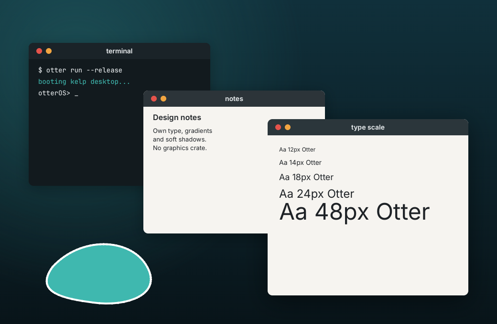

# OtterOS

OtterOS is an x86_64 operating system, written from scratch in Rust, boots on
real hardware (UEFI and legacy BIOS), and eventually gets you a desktop with
a mouse and windows, a terminal, a text editor, and its own TCP/IP stack
fetching a web page over Ethernet. "OtterOS" is a placeholder codename.

## Vision

OtterOS is an operating system written entirely by AI, with an AI living inside it. The finished demo
is three moments on an ordinary laptop, booted from a USB stick:

1. **Cold boot to a desktop.** Kernel, drivers, window system, network stack: every line written by AI
   agents. No human code, no borrowed OS libraries.
2. **Otter, offline.** A language model runs locally on OtterOS's own inference engine, across all CPU
   cores, with no internet connection.
3. **The AI operates its own OS.** With Ethernet plugged in, agent mode reaches Claude through
   OtterOS's own TCP/IP and TLS 1.3 stack. Claude asks to write a file and open it in the editor, the
   human clicks Allow, and the windows open.



*Rendered by `otter-gfx`, OtterOS's own graphics library: TrueType parsing, anti-aliased rasterization,
kerning, shadows and PNG encoding, all AI-written with zero dependencies.*

Progress, including the bugs the AI reviewer caught in the AI implementer's code, is logged in
[docs/BUILDLOG.md](docs/BUILDLOG.md). To try the current build on a real machine, see
[docs/HARDWARE.md](docs/HARDWARE.md).

## The AI-authored claim

No human writes code in this repository. Every kernel and userspace source
file is authored by Claude agents: an orchestrator plans and briefs each
task, `kernel-dev` implements it against a self-contained brief and runs its
own acceptance commands, and `kernel-review` reviews the unsafe-heavy diffs.
Humans run the agent loop and supply the hardware for the final demo.
DECISIONS.md D2 backs this with a hard rule: the only external crates the
kernel may depend on are `limine` (boot protocol structs), `bitflags`, and
`spin` -- no crate that implements OS logic (paging, allocators, a
scheduler, drivers, a filesystem, TCP/IP, ...) on the kernel's behalf. See
CLAUDE.md for the full agent roles/rules and DECISIONS.md for the rest of
the architecture record.

## Building and running

Everything below assumes macOS with Homebrew (`qemu`, `xorriso`, `mtools`)
and `rustup` installed, run from the repository root:

```sh
source scripts/env.sh   # puts rustup/cargo/homebrew on PATH
gmake check                # the milestone gate: every target below, in sequence,
                            # as a PASS/FAIL table; exits non-zero on any failure
gmake iso                # -> build/otteros.iso (hybrid UEFI + legacy BIOS)
gmake test                # headless UEFI boot, in-kernel tests, exit 0 on pass
gmake bios-test            # the same tests via the legacy BIOS boot path
gmake panic-test           # boots into a deliberate panic and checks it's reported
gmake fault-test           # boots into a deliberate page fault and checks it's reported
gmake df-test              # boots into a deliberate double fault and checks it's reported
gmake stackoverflow-test   # boots into a deliberate kernel stack overflow and checks it
gmake pmm-fault-tests      # PMM double-free and free-reserved-frame checks are reported
gmake heap-fault-tests     # heap double-free and slab class-mismatch checks are reported
gmake shot                 # headless boot -> artifacts/shot.png (QMP screendump)
gmake run                  # a real QEMU window, for humans
gmake lint                 # cargo clippy, including #[cfg(test)] code, -D warnings
```

`gmake check` (brief M1-T7) is the milestone gate: it runs `build`, `lint`,
`test`, `bios-test`, `fault-test`, `df-test`, `stackoverflow-test`,
`pmm-fault-tests`, `heap-fault-tests`, `panic-test` and `shot` in that order,
never stopping at the first failure, and prints one `[check] PASS <target>`
or `[check] FAIL <target>` line per target so a single command shows the
full state of a milestone at a glance.

`third_party/limine` (the bootloader binaries and host deploy tool) and
`third_party/limine-rust-template` (reference material) are fetched on
demand and gitignored; `gmake deps` fetches them explicitly. Serial COM1 is
the primary log channel -- every run tees it to `artifacts/serial.log`.

Use GNU Make as `gmake`, not `make` (macOS ships GNU Make 3.81; our
Makefile needs a modern one).

## Milestones

The full acceptance criteria for each milestone live in
[PLAN.md](PLAN.md); current progress is tracked in
[STATUS.md](STATUS.md). Summary:

| Milestone | What it proves |
| --- | --- |
| M0 Harness (done) | Boots to serial + framebuffer, in-kernel test runner, QEMU harness |
| M1 Kernel core (done) | GDT/IDT, ACPI + APIC, PS/2 keyboard, physical + virtual memory, heap, framebuffer console |
| M2 Processes | Preemptive scheduler, ring 3 with syscalls, ELF loader, initramfs, a userspace shell |
| M3 Storage | PCI, virtio-blk, FAT32 read/write, a VFS |
| M4 Desktop | Mouse, userspace compositor, anti-aliased TrueType text, terminal, editor |
| M5 Networking | virtio-net/e1000 and its own Ethernet/ARP/IPv4/TCP/UDP/DHCP/DNS stack |
| M6 Multicore | All CPUs online, SMP scheduler, user threads, AVX state |
| M7 Otter | A from-scratch LLM runtime running a small open model locally, and a chat app |
| M8 Trust | From-scratch cryptography and a TLS 1.3 client verified against real servers |
| M9 Agent mode | Claude (or Otter) operating the OS through human-approved tool calls |
| M10 Real hardware | USB (xHCI, HID, mass storage), the laptop's NIC, the recorded demo |

`gmake check` must stay green through M0-M9; M10 is demonstrated on real hardware.
